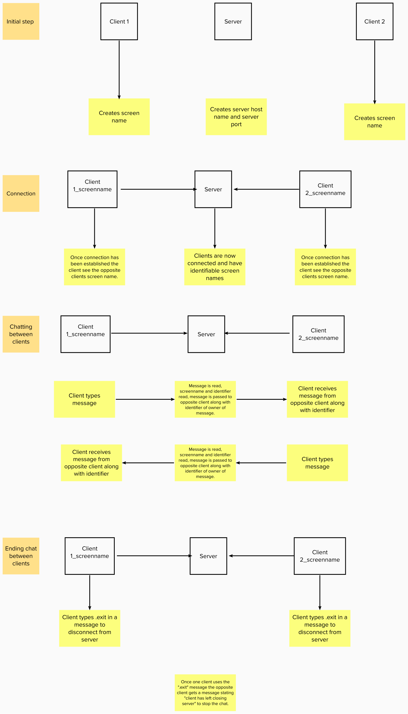

For my chat application, it will utilize python code to handle client/server interactions.
Before establishing connection between clients the server hosts and server port will be need to be named.

The application should only need to handle communication between two clients handled through one server.

The server should apply a unique identifier, a random number, to each client that would be apparent when each client sends/receives a message from each other
The idea is for the client to input a screen name, and to be able to send a message of any length to another client that will receive the message along with the sender's unique identifier and screen name.

The clients would be able to send/receive their messages until one of the client's input the ".exit" command and therefore the connection will conclude.

<h1> Design Flow </h1>

